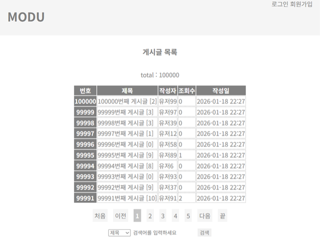
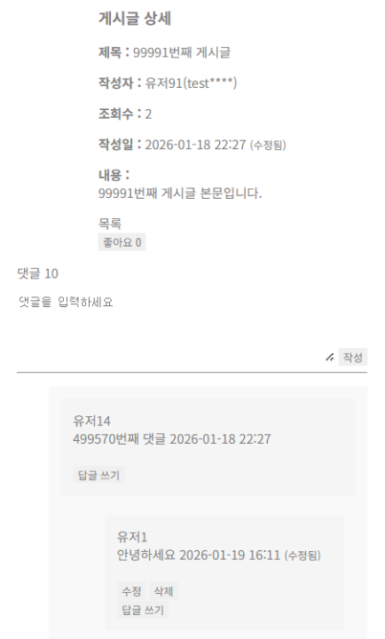

# 📋 게시판 프로젝트

#### 본 프로젝트는 Spring MVC 기반의 서버 사이드 렌더링(SSR) 환경에서 실무에서 마주치는 구조적 문제(보안, 성능, 예외 흐름)을 직접 경험하고 해결하는 것에 초점을 둔 프로젝트입니다.

## 기술 스택 (Tech Stack)

### Backend
- **Java 21**
- **Spring Boot 3.5.5**
- **Spring Data JPA**
- **Spring Security**

### Frontend
- **Thymeleaf**
- **jQuery**

### Database
- **MySQL 8.0**

## ERD
```mermaid
erDiagram
    USER ||--o{ POST : "작성"
    USER ||--o{ COMMENT : "작성"
    USER ||--o{ LIKE : "누름"
    POST ||--o{ COMMENT : "포함"
    POST ||--o{ LIKE : "받음"
    COMMENT ||--o{ COMMENT : "대댓글 (부모-자식)"

    USER {
        Long id PK
        String username "아이디"
        String password "해시"
        String nickname "닉네임"
        String email "이메일"
        Varchar role "UserRole (USER, KAKAO_USER, ADMIN, SUPER_ADMIN)"
        DateTime created_at
        DateTime updated_at
        Varchar status "UserStatus (ACTIVE, DISABLED)"
    }

    POST {
        Long id PK
        Long user_id FK "작성자 ID"
        String title "제목"
        Text content "본문"
        int view_count "조회수"
        int like_count "좋아요수"
        int comment_count "댓글수"
        DateTime published_at "발행일"
        DateTime created_at
        DateTime updated_at
        Varchar type "PostType (NOTICE, GENERAL)"
        Varchar state "PostState (DRAFT, PUBLISHED)"
        Varchar status "PostStatus (ACTIVE, DISABLED)"
    }

    COMMENT {
        Long id PK
        Long user_id FK "작성자 ID"
        Long post_id FK "게시글 ID"
        Long parent_id FK "부모댓글 ID (Self-Ref)"
        Text content "내용"
        DateTime created_at
        DateTime updated_at
        Varchar status "CommentStatus (ACTIVE, DISABLED)"
    }

    LIKE {
        Long id PK
        Long user_id FK "사용자 ID"
        Long post_id FK "게시글 ID"
        DateTime created_at
        DateTime updated_at
        Varchar status "LikeStatus (ACTIVE, DISABLED)"
    }
   ```

## 주요 기능 (Key Features)

### 1. 회원 기능 (User)
* 회원가입 및 로그인 (Spring Security)
* 일반 회원 가입 및 소셜 로그인 API(kakao)

### 2. 게시판 기능 (Post)
* 게시글 등록, 수정, 삭제, 조회
* 공지사항 및 일반 게시글 분류
* 게시글 임시저장 및 발행 기능

### 3. 댓글 및 대댓글 (Comment)
* 댓글 등록, 수정, 삭제, 조회
* 계층 구조 답글 기능 구현

### 4. 좋아요 (Like)
* 게시글 좋아요/취소 기능

## ⚙️ 설정 및 실행 방법 (Configuration & Setup)

보안을 위해 데이터베이스 접속 정보와 API 키는 환경 변수 또는 별도의 설정 파일을 사용합니다.

### 1. 환경 설정 (application.yml)
`src/main/resources/application.yml` 파일에 본인의 환경에 맞는 설정이 필요합니다. (민감 정보는 `.gitignore`로 관리되고 있습니다.)

```yaml
spring:
  datasource:
    url: jdbc:mysql://localhost:3306/demo_dev
    username: YOUR_USERNAME
    password: YOUR_PASSWORD

kakao:
  client_id: YOUR_KAKAO_CLIENT_ID
  redirect_uri: YOUR_KAKAO_REDIRECT_URI
```

### 2. 빌드 및 실행
```
./gradlew bootRun
```



